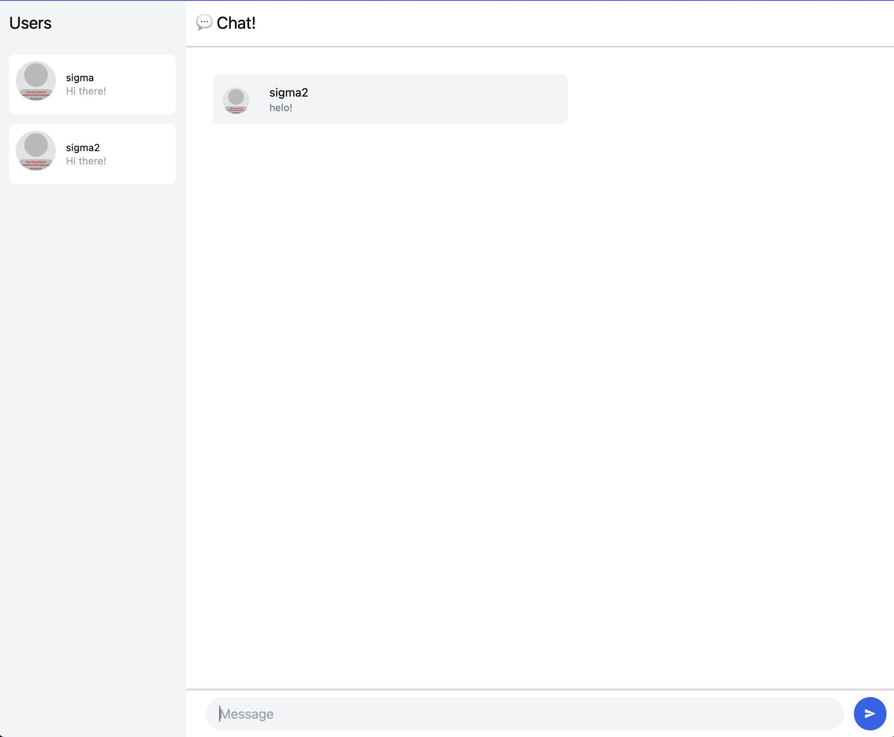
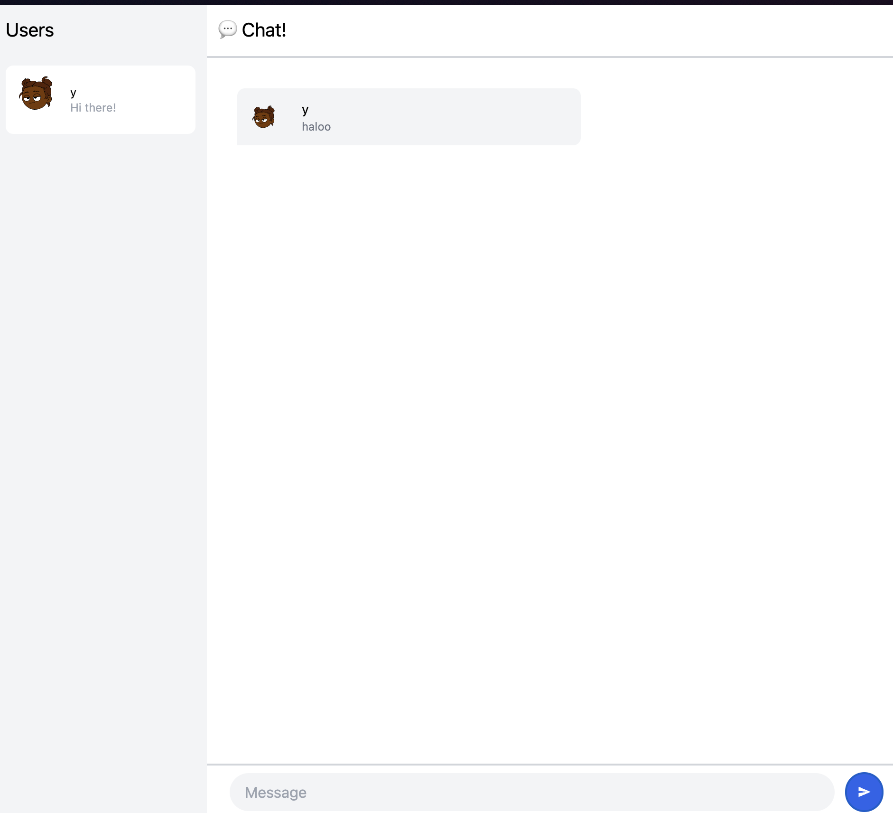

# advpro-tutorial10-yew

### 3.1. 
1. Clone dari:
https://github.com/jtordgeman/YewChat/tree/websockets-part2
dan
https://github.com/jtordgeman/SimpleWebsocketServer

2. Interaksi antar page yang telah memasukkan username ke dalam aplikasi dapat dilakukan. Hasilnya dapat dilihat seperti foto yang berada dibawah dimana ada dua user

### 3.2.

changed the default profile picture

